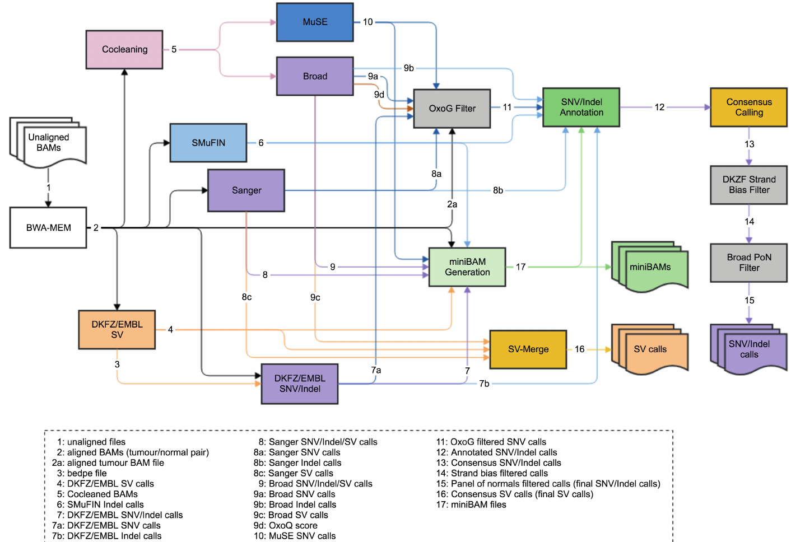

# PCAWG Complete Workflow

Work in progresss - Consolidation of all the disparate workflows described in PCAWG (https://www.nature.com/articles/s41586-020-1969-6) into a single workflow description for ease of understanding and execution. 

PCAWG supplementary figure 2. Flow-chart of variant calling in PCAWG.

# Additional Reading about relative value of consensus variant calling
### The consequences of variant calling decisions in secondary analyses of cancer genomics data
https://doi.org/10.1101/2020.01.29.924860 

### Comprehensive fundamental somatic variant calling and quality management strategies for human cancer genomes 
https://doi.org/10.1093/bib/bbaa083

### SomaticCombiner: improving the performance of somatic variant calling based on evaluation tests and a consensus approach
https://doi.org/10.1038/s41598-020-69772-8

# Major Steps Remaining
## Correctly describing and testing the current container/workflow/referencefiles collection
It's difficult to gauge which components are meaningfully out of date. I try just assume for now that using these not-updated subworkflows is fine and that it will not be burdensome to drop in updated versions later. 

## Finding/generating equivalent reference data files for hg38
As opposed to the hg37 used in original (https://dcc.icgc.org/releases/PCAWG/reference_data/) 
Its a substantial number of files.

# Additional documentation 
Found in TODO comments in the pcawg-complete-workflow.cwl file and miscellaneous notes in docs/misc_cwl_notes
